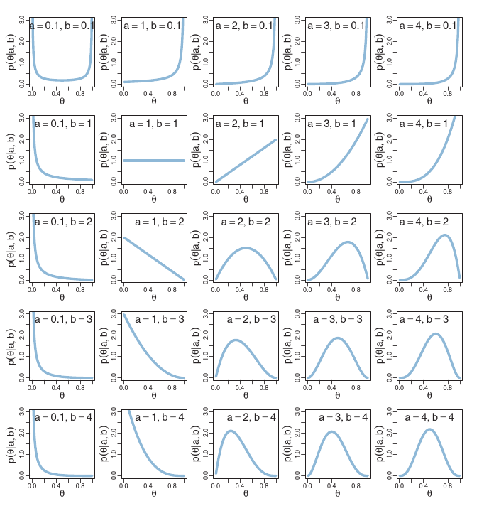

# Estimación de densidades con Bayes

## Introducción a la estimación Bayesiana

### Preliminares

Recordemos que tenemos \(f(\theta)\) la previa, \(L(\theta)\) la
verosimilitud de los datos y \(f(\theta|\text { data })\) la posterior
ajustada a los datos.

\begin{equation*}
	f(\theta | \text { data }) \propto f(\theta) L(\theta)
\end{equation*}

Además para el caso de la binomial tenemos que

\begin{equation*}
	f(y | \theta)=\theta^{\gamma}(1-\theta)^{(1-\gamma)}
\end{equation*}

y la distribución beta se escribe de la forma

\begin{align*}
	f(\theta | a, b) & =\operatorname{beta}(\theta | a, b)         \\
	                 & =\theta^{(a-1)}(1-\theta)^{(b-1)} / B(a, b)
\end{align*}

donde

\begin{equation*}
	B(a, b)=\int_{0}^{1}  \theta^{(a-1)}(1-\theta)^{(b-1)}\mathrm{d} \theta.
\end{equation*}

Los valores de \(a\) y \(b\) controlan la forma de esta distribución



Una forma alternative es \(\mu=a /(a+b)\) es la media, \(\kappa=a+b\)
es la concentración y \(\omega=(a-1) /(a+b-2)\) es la moda de la
distribución Beta, entonces se cumple que

\begin{align*}
		  & a=\mu \kappa \quad \text { y } \quad b=(1-\mu) \kappa                                         \\
		  & a=\omega(\kappa-2)+1 \quad \text { y } \quad b=(1-\omega)(\kappa-2)+1 \text { para } \kappa>2
\end{align*}

Es decir, es posible estimar \(a\) y \(b\) de \(\kappa\), \(\mu\) y \(\omega\)

De acuerdo la combinación de estas dos distribuciones forma una familia conjugada de modo que

\begin{align*}
		f(\theta | z, N)
		  & = f(z, N | \theta) f(\theta) / f(z, N)
		\quad                                              \\
		  & = \theta^{z}(1-\theta)^{(N-z)} \frac{\theta^{(a-1)}(1-\theta)^{(b-1)}}{B(a, b)} / p(z, N) \\
		  & = \theta^{z}(1-\theta)^{(N-z)} \theta^{(a-1)}(1-\theta)^{(b-1)} /[B(a, b) p(z, N)]        \\
		  & = \theta^{((z+a)-1)}(1-\theta)^{((N-z+b)-1)} /[B(a, b) p(z, N)]                           \\
		  & = \theta^{((z+a)-1)}(1-\theta)^{((N-z+b)-1)} / B(z+a, N-z+b)
\end{align*}

### Ejemplo sencillo

Suponga que se hace una encuesta a 27 estudiantes y se encuentra que
11 dicen que duermen más de 8 horas diarias y el resto no. Nuestro
objetivo es encontrar inferencias sobre la proporción $p$ de
estudiantes que duermen al menos 8 horas diarias. El modelo más
adecuado es

\[
		f(x \vert p) \propto p^s (1-p)^f
\]

donde $s$ es la cantidad de estudiantes que duermen más de 8 horas y
$f$ los que duermen menos de 8 horas.

Una primera aproximación para la previa es usar una distribución
discreta. En este caso, el investigador asigna una probabilidad a
cierta cantidad de horas de sueño, según su experiencia. Así, por
ejemplo:

```{r}
(p <- seq(0.05, 0.95, by = 0.1))
(prior <- c(1, 5.2, 8, 7.2, 4.6, 2.1, 0.7, 0.1, 0, 0))
(prior <- prior / sum(prior))
plot(p, prior, type = "h", ylab = "Probabilidad Previa")
```

El paquete `LearnBayes` tiene la función `pdisc` que estima la
distribución posterior para una previa discreta binomial. Recuerde que
el valor 11 representa la cantidad de estudiantes con más de 8 horas
de sueño y 16 lo que no duermen esa cantidad.

```{r}
library(LearnBayes)
data <- c(11, 16)
post <- pdisc(p, prior, data)
round(cbind(p, prior, post), 2)
```

Y podemos ver la diferencia entre la previa (negro) y la posterior
(roja),

```{r}
plot(p, post, type = "h", col = "red")
lines(p + 0.01, prior , type = "h")
```

¿Qué se puede deducir de estos resultados?

### Datos reales

Continuemos el ejercicio pero esta vez usando datos reales.

Carguemos los datos `studdendata` del paquete `LearnBayes`. Esta base
son preguntas que se le hicieron a un grupo de estudiantes de  Bowling
Green State University. Para mayor información use `?studentdata`.

```{r}
	data("studentdata")
```

Como solo se tiene la hora de dormir y la hora de despertarse, se debe tomar la diferencia.

```{r}
horas_sueno <- studentdata$WakeUp - studentdata$ToSleep
horas_sueno <- na.omit(horas_sueno)
summary(horas_sueno)
hist(horas_sueno, main = "")
```

Ahora supongamos que se tiene quiere ajustar una previa continua a este modelo. Para esto usaremos una distribución Beta con parámetros $\alpha$ y $\beta$, de la forma

\[
	f(p\vert \alpha, \beta) \propto p^{1-\alpha} (1-p)^{1-\beta}.
\]

El ajuste de los parámetros de la Beta depende mucho de la información
previa que se tenga del modelo. Una forma fácil de estimarlo es a
través de cuantiles con los cuales se puede reescribir estos
parámetros. En particular, suponga que se cree que el $50\%$ de las
observaciones la proporción será menor que 0.3 y  el $90\%$ será menor
que 0.5.

Para esto ajustaremos los siguientes parámetros

```{r}
quantile2 <- list(p = .9, x = .5)
quantile1 <- list(p = .5, x = .3)
ab <- beta.select(quantile1, quantile2)

a <- ab[1]
b <- ab[2]
s <- 11
f <- 16

```

En este caso se obtendra la distribución posterior Beta con paramétros
$\alpha + s$ y $\beta + f$,

```{r}
curve(
  dbeta(x, a + s, b + f),
  from = 0,
  to = 1,
  xlab = "p",
  ylab = "Densidad",
  lty = 1,
  lwd = 4
)
curve(dbeta(x, s + 1, f + 1),
      add = TRUE,
      lty = 2,
      lwd = 4)
curve(dbeta(x, a, b),
      add = TRUE,
      lty = 3,
      lwd = 4)
legend(
  .7,
  4,
  c("Previa", "Verosimilitud", "Posterior"),
  lty = c(3, 2, 1),
  lwd = c(3, 3, 3)
)
```

En particular, si estamos interesados en \(\mathbb{P}(p>=.5 | \text {
		data })\) se puede estimar con

```{r}
1 - pbeta(0.5, a + s, b + f)
```

y el intervalo de confianza correspondiente a esta distribución sería

```{r}
qbeta(c(0.05, 0.95), a + s, b + f)
```

Otra opción para estimar este intervalo es simular 1000 veces la
distribución beta y observar su comportamiento en los cuantiles

```{r}
ps <-  rbeta(1000, a + s, b + f)
hist(ps, xlab = "p", main = "")
```

La probabilidad que este valor sea mayor que 0.5 es

```{r}

sum(ps >= 0.5)/1000
```

```{r}
quantile(ps, c(0.05, 0.95))
```

## Previa de histograma

El caso anterior funciona perfecto dada la combinación Binomial-Beta.

¿Qué pasaría si nuestra previa no está basada beta, sino que
quisiéramos extraerla directamente de los datos?

El método que usaremos será el siguiente:

- Elija una cuadrícula de valores de $p$ sobre un intervalo que cubra
la densidad posterior.
- Calcule el producto de la probabilidad $L (p)$ y el $f (p)$ sobre
esa grilla.
- Normalice dividiendo cada producto por la suma de los productos. En
esto paso, estamos aproximando la densidad posterior por una
probabilidad discreta Distribución en la grilla.
- Usando el comando `sample` de `R`, tome una muestra aleatoria con
reemplazo de la distribución discreta.

El resultado nos debe arrojar una muestra de la distribución posterior
sobre la grilla

Suponga nuevamente que tenemos las mismas previas dadas al inicio del
capítulo

```{r} 
midpt <- seq(0.05, 0.95, by = 0.1)
prior <- c(1, 5.2,  8, 7.2, 4.6, 2.1, 0.7, 0.1, 0, 0)
prior <- prior / sum(prior) 
```

Con la función  `histprior` construye los valores de $p$ sobre una
grilla.

```{r}
curve(
  histprior(x, midpt, prior),
  from = 0,
  to = 1,
  ylab = "Densidad previa",
  ylim = c(0, .3)
)
```

Luego recordando que nuestra posterior es \(beta(s+1,f+1)\) tenemos que

```{r}
	curve(
	histprior(x, midpt, prior) * dbeta(x, s + 1, f + 1),
	from = 0,
	to = 1,
	ylab = "Densidad posterior"
	)
```

Para conseguir la distribución posterior, solo debemos de construirla para una secuencia ordenada de valores $p$

```{r}
p = seq(0, 1, length = 1000)
post = histprior(p, midpt, prior) * dbeta(p, s + 1, f + 1)
post = post / sum(post)
```

Finalmente basta con tomar el muestreo de la posterior

```{r}
ps <- sample(p, replace = TRUE, prob = post)
hist(ps, xlab = "p", main = "")
```

## Monte Carlo methods

El tratamiento clásico de la estimación de parámetros bayesiana nos dice que si tenemos una densidad previa y la ``combinamos'' con la verosimilitud de los datos, estos nos dará una densidad con más información. Se podría repetir el proceso varias veces para tratar de ajustar mejor la densidad posterior.

Sin embargo, se podría usar potencia de los métodos Monte Carlo para que esta búsqueda sea muy efectiva para encontrar los parámetros adecuados.

## Ejemplo del viajero

Suponga que tenemos un viajero que quiere estar en 7 lugares distintos (suponga que están en línea recta) y la probabilidad de pasar a un lugar a otro se decide tirando una moneda no sesgada (50\% a la derecha y 50\% a la izquierda).

Este caso sería una simple caminata aleatoria sin ningún interés en particular.

Suponga además, que el viajero quiere estar más tiempo donde haya una mayor cantidad de personas \(P\) pero siguiendo ese patrón aleatorio. Entonces la forma de describir su decisión de moverse sería:

```{r echo=FALSE}
knitr::asis_output(if (knitr:::is_latex_output()) {
  '
\\begin{tabular}{p{6cm}|p{6cm}}
\\toprule
\\multicolumn{2}{c}{Tira la moneda y decide si va a la izquierda o la derecha} \\\\
\\midrule
\\multicolumn{2}{c}{Tiene dos opciones} \\\\
\\midrule \\midrule
Si el lugar nuevo tiene \\textbf{MÁS} personas que el actual salta a ese lugar 
&	Si el lugar nuevo tiene \\textbf{MENOS} personas entonces calcula la probabilidad de moverse como $p_{moverse} = P_{nuevo}/P_{actual}$. 

Entonces el viajero tira un número aleatorio del 0 al 1 y si este	menor que $(p_{moverse}$ entonces se mueve. 

Si tira un número mayor a $p_{moverse}$ se queda donde está. \\\\
\\bottomrule
\\end{tabular}
'
  
} else {
  '<table>
	<TR>
	<TD style = "text-align:center", COLSPAN="2">Tira la moneda y decide
	si va a la izquierda o la derecha</TD>
	</TR>
	<TR>
	<TD style = "text-align:center" COLSPAN="2">Tiene dos opciones</TD>
	</TR>
	<TR>
	<TD>Si el lugar nuevo tiene **MÁS** personas que el actual salta a ese
	lugar</TD>
	<TD>Si el lugar nuevo tiene **MENOS** personas entonces calcula la
	probabilidad de moverse como $p_{moverse} = P_{nuevo}/P_{actual}$.

	Entonces el viajero tira un número aleatorio del 0 al 1 y si este
	menor que $p_{moverse}$ entonces se mueve.

	Si tira un número mayor a $p_{moverse}$ se queda donde está. </TD>
</TR>
</table>'
})
```


	

```{r,cache=TRUE}
P <- 1:7

pos_actual <- sample(P, 1)
pos_nueva <- pos_actual

n_pasos <- 50000
trayectoria <- numeric(n_pasos)

trayectoria[1] <- pos_actual

for (k in 2:n_pasos) {
		#Tira la moneda para decidir

		moneda <-   rbinom(1, 1, 0.5)
		# moneda  es 0 o 1
		pos_nueva <- pos_actual
		if (moneda == 1 & (pos_actual + 1) <= 7) {
				pos_nueva = pos_actual + 1
			} else if (moneda == 0 & (pos_actual - 1) >= 1) {
				pos_nueva <- pos_actual - 1
			}

		p_moverse <-  min(pos_nueva / pos_actual, 1)

		hay_movimiento <- 1 - p_moverse <= runif(1)

		if (hay_movimiento) {
				pos_actual <- pos_nueva
			}

		trayectoria[k] <- pos_nueva
	}

```

```{r}
df <- data.frame(x = 1:n_pasos, P = trayectoria)

ggplot(df[1:200, ]) +
  geom_line(aes(x, P)) +
  coord_flip() +
  theme_minimal(base_size = 16)


ggplot(df) +
  geom_histogram(aes(P), stat = "count") +
  theme_minimal(base_size = 16)

```

```{r} 
mean(trayectoria) 
sd(trayectoria) 
```

## El algoritmo de Metropolis-Hasting

El ejemplo anterior era bastante sencillo pero demuestra que se puede
encontrar el mejor estimador posible simplemente ejecutando una y otra
vez maximizando la estadía en los lugares más poblados.

En este ejemplo la función a maximizar es la cantidad de personas
\(P(\theta)=\theta\), pero en general nuestro objetivo será maximizar
la distribución posterior \(f(\theta| \text{ datos })\).

En palabras simples el algoritmo de Metropoli Hasting es

1. Simule un valor \(\theta^{*}\) de una densidad de propuesta
\(p\left(\theta^{*} | \theta^{t-1}\right)\)
2. Estime la razón
\[
	R=\frac{f\left(\theta^{*}\right) p\left(\theta^{t-1} |
		\theta^{*}\right)}{f\left(\theta^{t-1}\right) p\left(\theta^{*} |
		\theta^{t-1}\right)}
\]
3. Estima la probabilidad de aceptación \(	p_{\text {moverse }}=\min \{R, 1\}\).
4. Tome \(\theta^{t}\) tal que \(\theta^{t}=\theta^{*}\)
con probabilidad \(	p_{\text {moverse }}\); en otro caso \(\theta^{t}=\) \(\theta^{t-1}\)

El algoritmo de Metropolis-Hastings se puede construir de muchas
formas, dependiendo de la densidad de proposición

Si esta es independiente de las elecciones anteriores entonces,
\[
	p\left(\theta^{*} | \theta^{t-1}\right)=p\left(\theta^{*}\right)
\]

Otras formas es escoger
\[
	p\left(\theta^{*} |
	\theta^{t-1}\right)=h\left(\theta^{*}-\theta^{t-1}\right)
\]
donde \(h\) es simetrica alrededor del origen. En este tipo de
cadenas, la razón \(R\) tiene la forma
\[
	R=\frac{f\left(\theta^{*}\right)}{f\left(\theta^{t-1}\right)}
\]

Una última opción es tomar
\[
	\theta^{*}=\theta^{t-1}+ Z
\]

donde \(Z\) es una normal centrada con cierta estructura de varianza.

Retomemos el ejemplo del viajero. Supongamos que ahora existen una
cantidad infinita de lugares a los que puede ir y que la población de
cada isla es proporcional a la densidad posterior. Además, el viajero
podría saltar a cualquier isla que quisiera y su probabilidad de 
salto cae de forma continua en el intervalo \([0,1]\).

Para hacer este ejemplo concreto, el viajero no conoce cuál es su 
probabilidad de salto \(\theta\) pero sabe que ha tirado la
moneda \(N\) veces y observado \(z\) exitos. Por lo tanto tendremos
una verosimilitud de \(f(z, N |
\theta)=\theta^{z}(1-\theta)^{(N-z)}\).

La  previa será dada por \(f(\theta)=\operatorname{beta}(\theta | a,
b)\).

Los saltos serán gobernados por una normal centrada con media
\(\sigma\) de modo que \(\Delta \theta \sim
\mathcal{N}\left(0,\sigma^{2}\right)\).

Entonces el algoritmo de Metropolis Hasting se puede reformular como

1. Simule un valor de salto\(\Delta \theta \sim
\mathcal{N}\left(0,\sigma^{2}\right)\) y denote \(\theta^{t} =
\theta^{t} + \Delta\theta\).
2. Probabilidad de aceptación $	p_{\text {moverse }}$
\begin{align*}
	p_{\text {moverse }}
	  & =\min \left(1, \frac{P\left(\theta_{\ast}\right)}{P\left(\theta_{t-1}\right)}\right) \\
				  & =\min \left(1, \frac{p\left(D |
		\theta_{\ast}\right) p\left(\theta_{\ast}\right)}{p\left(D | \theta_{t-1}\right)
		p\left(\theta_{t-1}\right)}\right) \\
	  & =\min \left(1, \frac{\operatorname{Bernoulli}\left(z, N |
		\theta_{\ast}\right)
		\operatorname{beta}\left(\theta_{\ast} | a,
		b\right)}{\operatorname{Bernoulli}\left(z, N |
		\theta_{t-1}\right)
		\operatorname{beta}\left(\theta_{t-1} | a, b\right)}\right) \\
	  & =\min \left(1,
	\frac{\theta_{\ast}^{z}\left(1-\theta_{\ast}\right)^{(N-z)}
			\theta_{\ast} \left(1-\theta_{\ast}\right)^{(b-1)}
			/ B(a,b)}{\theta_{t-1}^{z}\left(1-\theta_{t-1}\right)^{(N-z)}
			\theta_{t-1}^{(a-1)}\left(1-\theta_{t-1}\right)^{(b-1)}
			/ B(a, b)}\right)
\end{align*}

3. Tome \(\theta_{t}\) tal que \(\theta_{t}=\theta_{*}\)
con probabilidad \(	p_{\text {moverse }} ;\) en otro caso \(\theta_{t}=\) \(\theta_{t-1}\)


En el ejemplo del viajero queremos ver la probabilidad \(\theta\) de 
que salte al siguiente destino. Tomemos \(\sigma=0.2\) y supongamos 
que se ha visto que el viajero de \(N=20\) y \(z=14\) éxitos.  Por 
cuestiones de practicidad se tomará \(\theta_0 = 0.1\).


```{r, cache=TRUE}
# Carga de datos observados
datos_observados <- c(rep(0, 6), rep(1, 14))

# Función de verosimilitud Binomial
verosimilitud <- function(theta, data) {
  z <- sum(data)
  N <- length(data)
  pDatosDadoTheta <- theta ^ z * (1 - theta) ^ (N - z)
  # Es para asegurarse que los datos caigan en [0,1].
  pDatosDadoTheta[theta > 1 | theta < 0] <- 0
  return(pDatosDadoTheta)
}

# densidad previa
previa <- function(theta) {
  pTheta <- dbeta(theta, 1, 1)
  # Es para asegurarse que los datos caigan en [0,1].
  pTheta[theta > 1 | theta < 0] <- 0
  return(pTheta)
}

# densidad posterior
posterior <- function(theta, data) {
  posterior <- verosimilitud(theta, data) * previa(theta)
  return(posterior)
}

n_pasos <- 50000

trayectoria <- rep(0, n_pasos)

# Valor inicial
trayectoria[1] <- 0.01

n_aceptados <- 0
n_rechazados <- 0


sigma <- 0.2

for (t in 2:(n_pasos - 1)) {
  pos_actual <- trayectoria[t]
  
  salto_propuesto <- rnorm(1, mean = 0, sd = sigma)
  
  proba_aceptacion <-
    min(
      1,
      posterior(pos_actual + salto_propuesto,
                datos_observados) / posterior(pos_actual, datos_observados)
    )
  
  # Aceptamos el salto?
  if (runif(1) < proba_aceptacion) {
    # Aceptados
    trayectoria[t + 1] <- pos_actual + salto_propuesto
    n_aceptados <- n_aceptados + 1
  } else {
    # Rechazos
    trayectoria[t + 1] <- pos_actual
    n_rechazados <- n_rechazados + 1
  }
}


```

```{r, warning=FALSE}
df <- data.frame(x = 1:n_pasos, P = trayectoria)

ggplot(df[1:500,]) +
  geom_line(aes(x, P), size = 0.5) +
  coord_flip() +
  theme_minimal(base_size = 16)

ggplot(df) +
  geom_histogram(aes(P, y = ..density..), color = "white") +
  theme_minimal(base_size = 16)

```